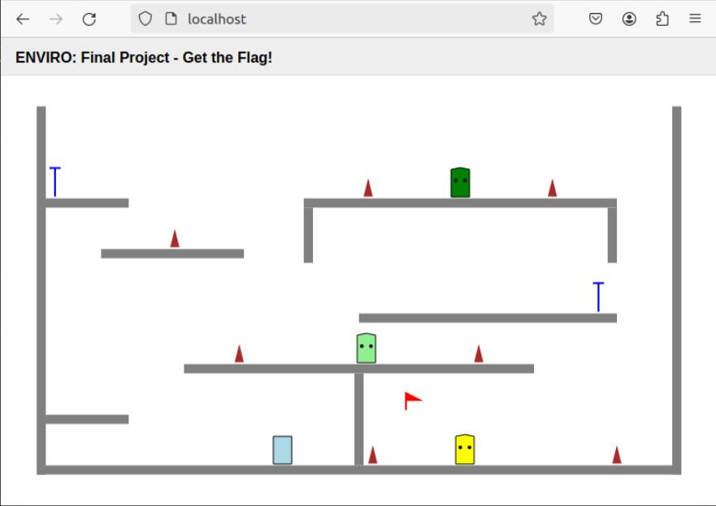
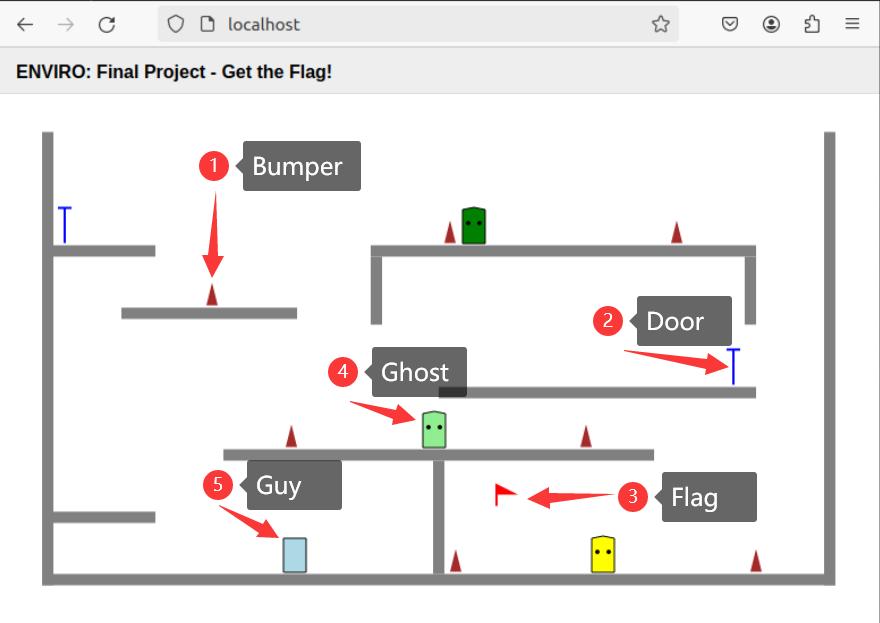

# Get the Flag!

Final project for University of Washington EE P 520: Software Engineering for Embedded Applications. 

This is a small game. The player controls a little Guy to avoid Bumpers and Ghosts in the maze by moving and jumping, and finally gets the red flag in the maze.



## Installation

OS: Linux

Download the image, run in a terminal window the following command:

```
docker pull klavins/ecep520:cppenv
```

Start a Docker container with ENVIRO pre-loaded into it:

```
docker run -p80:80 -p8765:8765 -v $PWD:/source -it klavins/enviro:v1.61 bash
```

Make the project and start the enviro server as follows:

```
make
esm start
enviro
```

- The `-p80:80` option maps *port* 80 from the Docker container to ports on your host computer. This should allow you to go to
  
  > [http://localhost](http://localhost/) with your web browser and see the ENVIRO client.

- The `-p8765:8765` option allows the ENVIRO client to communicate with the `enviro` server via a *WebSocket*.

- The command `esm start` uses the enviro setup manager to start a web server from which your browser can access the ENVRIO client.

## Start the Game



1. **Bumper:** Limit the Ghost's movement range (static object).

2. **Door:** Server as a teleporter (static object).

3. **Flag:** Reset the game (static object).

4. **Ghost:** Player hunter (dynamic object).

5. **Guy:** Controlled by the player, it can move left and right and jump (dynamic object).

> **RULES:**
> 
> 1. Ghost patrols between two Bumpers
> 
> 2. Ghost will kill Guy if colliding with a Guy
> 
> 3. Guy is in control of the player with keyboard
> 
> 4. Guy aims to get the red flag in the maze
> 
> 5. Guy can move left and right, and jump
> 
> 6. Guy will be killed by Ghost if colliding with a Ghost
> 
> 7. Guy will be killed by Bumper if colliding with a Bumper
> 
> 8. Guy can tp between the doors with a same color
> 
> **CONTROL:**
> 
> 1. Left:    Press 'A'
> 
> 2. Right:  Press 'D'
> 
> 3. Jump:  Press 'Space'

## The Goal of the Project

The goal of the project is to build up an system that uses Elma and Enviro. Through this project, I practiced object-oriented programming based on C++ and programming based on Event Loop.

## Key Challenges

##### 1. Move with Keyboard

We need to mapping the keyboard to the opeartors using function `wathch()`.

```cpp
watch("keydown", [&](Event& e) {
    std::string k = e.value()["key"];
    if (k == " " && !airborne()) {
        JUMP = true;
    } else if (k == "a") {
        LEFT = true;
    } else if (k == "d") {
        RIGHT = true;
    } 
});
watch("keyup", [&](Event& e) {
    std::string k = e.value()["key"];
    if (k == "a") {
        LEFT = false;
    } else if (k == "d") {
        RIGHT = false;
    }
});
```

##### 2. Teleport

Once the agent collides with a Door, the agent should be teleport to the position of another Door with the same color.

```cpp
teleport(x,y,theta);
```

##### 3. Collision

Once the agent collides with another agent, do the function defined into the `notice_collisions_with()`.

For example, I implemented the rule of *Guy will be killed by Ghost if colliding with a Ghost* with the code below.

```cpp
// If the Guy makes a collision with a Ghost
// then go back to the starting point
notice_collisions_with("Ghost", [&](Event &e) {
    teleport(-40,135,0);
});
```

##### 4. Patorl

Once a Ghost collides with a Bumper, Ghost should change the direction.

```cpp
// If the Ghost makes a collision with a Bumper
// then change the direction
notice_collisions_with("Bumper", [&](Event &e) {
    vx = -vx;
});
```

## References

- [Elma](https://github.com/klavinslab/elma)

- [Enviro](https://github.com/klavinslab/enviro)


